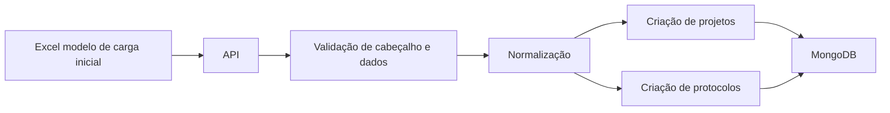
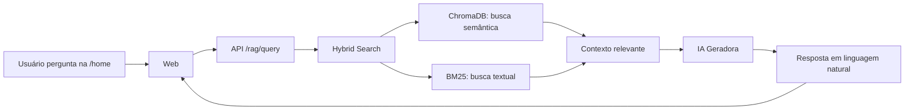

# 00 — Visão Geral da Arquitetura

## Objetivo do sistema

Construir uma plataforma para substituir o acompanhamento manual de protocolos em planilhas e sites públicos por um fluxo centralizado, automatizado e consultável por linguagem natural.

O sistema deve:

- importar a planilha modelo de carga inicial;
- criar projetos e protocolos no MongoDB;
- consultar sites reais de stakeholders/órgãos públicos;
- salvar o HTML bruto das consultas;
- limpar o HTML para remover ruído;
- usar IA local para extrair dados estruturados;
- atualizar os dados do protocolo no MongoDB;
- indexar informações relevantes no ChromaDB;
- permitir consultas via RAG em uma tela estilo chat;
- oferecer telas de CRUD para projetos, protocolos e stakeholders;
- destacar divergências entre o status informado no sistema e o status encontrado no site;
- parar de monitorar protocolos encerrados manualmente.

---

## Fluxos principais

### 1. Carga inicial



A carga inicial é o onboarding do sistema. Quando a empresa começa a usar a plataforma, ela importa a planilha modelo e os dados passam a existir no MongoDB. Depois disso, a planilha deixa de ser a fonte principal; o sistema passa a ser a fonte operacional.

---

### 2. Scraping e extração de dados

```mermaid
flowchart LR
    A[Scheduler] --> B[API cria jobs de scraping]
    B --> C[RabbitMQ: scraping.jobs]
    C --> D[Scraper]
    D --> E[Site real do stakeholder]
    E --> F[HTML bruto]
    F --> G[MongoDB: scraped_contents]
    G --> H[RabbitMQ: cleaner.jobs]
    H --> I[Cleaner/Parser]
    I --> J[Texto limpo]
    J --> K[MongoDB]
    K --> L[RabbitMQ: ai.extraction.jobs]
    L --> M[IA Extratora]
    M --> N[JSON estruturado]
    N --> O[RabbitMQ: ai.extraction.results]
    O --> P[API]
    P --> Q[MongoDB]
    P --> R[ChromaDB]
```



---

### 3. RAG / Tela de IA



---

## Serviços do projeto

| Serviço        | Responsabilidade principal                                                                        |
| -------------- | ------------------------------------------------------------------------------------------------- |
| API / Backend  | Autenticação, CRUDs, regras de negócio, importação, persistência, RAG e integração entre serviços |
| Web            | Interface do usuário: login, dashboard, projetos, protocolos, stakeholders e chat RAG             |
| MongoDB        | Banco operacional principal                                                                       |
| RabbitMQ       | Mensageria entre scraping, cleaner/parser, IA e API                                               |
| Scraper        | Consulta sites reais usando URL e dados do protocolo                                              |
| Cleaner/Parser | Remove ruído do HTML e gera texto útil para IA                                                    |
| IA Extratora   | Analisa texto limpo e retorna JSON estruturado                                                    |
| ChromaDB       | Base vetorial para RAG                                                                            |
| IA RAG         | Responde perguntas em linguagem natural com base nos dados do sistema                             |

---

## Princípios arquiteturais

### 1. MongoDB é a fonte operacional

Tudo que o sistema usa para telas, CRUDs e regras deve estar no MongoDB. O ChromaDB não substitui o MongoDB.

### 2. ChromaDB é base de busca semântica

O ChromaDB deve armazenar textos resumidos e relevantes para busca e RAG, não necessariamente HTML bruto inteiro.

### 3. RabbitMQ deve transportar IDs, não HTML gigante

As mensagens devem conter referências para documentos no MongoDB. Exemplo:

```json
{
  "job_id": "job_123",
  "protocol_id": "prot_123",
  "scraped_content_id": "content_123"
}
```

### 4. IA extrai, API decide

A IA deve extrair dados. A API deve validar, aplicar regra de negócio, comparar divergências e salvar.

### 5. Erros devem ser visíveis

Erro de scraping, protocolo não encontrado, IA inválida e site indisponível devem ser salvos e exibidos separadamente.

---

## Convenções de entidade

### Projeto

Representa o empreendimento ou agrupador principal.

Exemplos:

- Residencial Horizonte;
- Loteamento Jardim Sul;
- Condomínio Bela Vista.

### Protocolo / Atividade

No sistema, o usuário pode enxergar como “atividade”. No código, a entidade deve ser `protocols`.

Representa o processo específico que será acompanhado em um stakeholder/órgão.

Cada protocolo pertence a um projeto.

### Stakeholder

Representa a origem/órgão/site onde o protocolo será consultado.

Exemplos:

- Copel;
- Prefeitura;
- Cartório;
- Tabelionato;
- Órgão ambiental.

---

## Rotas principais esperadas

| Rota                                         | Função                          |
| -------------------------------------------- | ------------------------------- |
| `/login`                                     | Login único                     |
| `/home`                                      | Tela de IA/RAG                  |
| `/dashboard`                                 | Visão geral                     |
| `/projetos`                                  | Listagem de projetos            |
| `/projetos/new`                              | Novo projeto                    |
| `/projetos/:id`                              | Visualizar projeto e protocolos |
| `/projetos/:id/edit`                         | Editar projeto                  |
| `/projetos/:id/protocolos`                   | Listar protocolos do projeto    |
| `/projetos/:id/protocolos/new`               | Criar protocolo                 |
| `/projetos/:id/protocolos/:protocoloId`      | Visualizar protocolo            |
| `/projetos/:id/protocolos/:protocoloId/edit` | Editar protocolo                |
| `/stakeholders`                              | Listagem de stakeholders        |
| `/stakeholders/new`                          | Criar stakeholder               |
| `/stakeholders/:id`                          | Visualizar stakeholder          |
| `/stakeholders/:id/edit`                     | Editar stakeholder              |

---

## MVP recomendado

1. Login com usuário único.
2. Importação da planilha modelo.
3. CRUD de projetos.
4. CRUD de protocolos com campo CNPJ obrigatório.
5. CRUD de stakeholders com URL de consulta.
6. Listagem e Kanban para projetos/protocolos.
7. Scheduler simples para disparar scraping.
8. Scraper real para pelo menos um stakeholder.
9. Salvamento do HTML bruto no MongoDB.
10. Cleaner/parser para texto limpo.
11. IA local com Ollama + Qwen retornando JSON.
12. Endpoint da API para receber dados tabulados.
13. Detecção de divergência entre status do sistema e status encontrado no site.
14. Separação visual para protocolos não encontrados.
15. Indexação no ChromaDB.
16. Tela `/home` com RAG e perguntas em linguagem natural.

---

## Fora do MVP

- Multiusuário e permissões avançadas;
- notificações WhatsApp/Telegram/Teams;
- exportação PDF avançada;
- múltiplos perfis de acesso;
- histórico completo de status;
- automação avançada para sites com captcha;
- dashboards com muitos gráficos.
